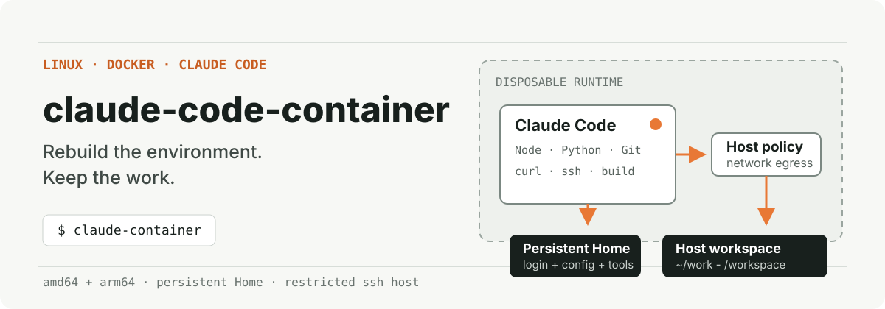
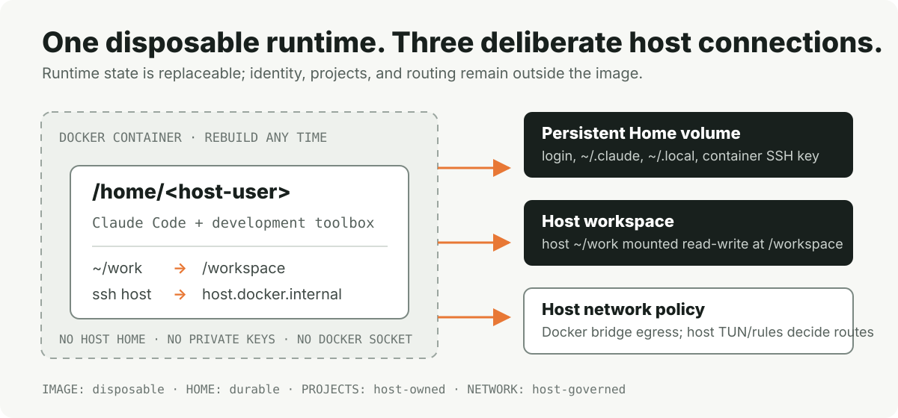

<p align="center">
  
</p>

<p align="center">
  <strong>A portable Linux development container for Claude Code with a persistent identity and a disposable runtime.</strong>
</p>

<p align="center">
  <a href="./LICENSE"></a>
  
  
</p>

`claude-code-container` gives Claude Code a consistent Linux toolbox without turning
the container into the owner of your work. Rebuild the image when the toolchain
changes; keep login state and user-installed tools in a named volume; keep
projects on the host; let the host decide how network traffic is routed.

## Start here

### Requirements

- Linux on `amd64` or `arm64`, or Apple Silicon macOS with OrbStack
- Docker Engine available to the current user without `sudo`; on macOS it is provided by OrbStack
- Bash, Python 3, and an OpenSSH server
- A writable `~/.ssh/authorized_keys`
- A host workspace at `~/work`, or a custom `CLAUDE_CODE_CONTAINER_WORKSPACE`

### Install

```bash
git clone https://github.com/ada20204/claude-code-container.git
cd claude-code-container
./install.sh
"$HOME/.local/bin/claude-code-container" install
source ~/.bashrc  # Linux
# source ~/.zshrc # macOS
```

Enter the environment:

```bash
claude-container
```

The default directory matches the host user's Home path: `/home/<user>` on
Linux and `/Users/<user>` on macOS. Projects are available at
both `~/work` and `/workspace`. From inside the container, return to the host
with the generated key:

```bash
ssh host
```

Installation stops instead of replacing a conflicting `Host host` entry,
`claude-container` alias, or `~/work` path. It reports success only after a real
non-interactive SSH connection back to the host succeeds.

The project does not modify `PATH`. `~/.local/bin/claude-code-container` is an
internal lifecycle launcher; after initialization, `claude-container` is the
only interactive entry point.

## What stays when the container goes away

<p align="center">
  
</p>

The image contains Claude Code and the development toolbox. The running
container is disposable. State is divided deliberately:

- **Persistent Home** stores Claude login state, `~/.claude/CLAUDE.md`, the
  container-to-host SSH key, and user-level tools under `~/.local`.
- **Host workspace** keeps projects under the host's `~/work` and mounts them
  read-write at `/workspace`; `~/work` inside the container is a symlink to it.
- **Standard host directories** mount `~/Downloads`, `~/Documents`, `~/Desktop`,
  and `~/.claude/projects` read-write at the same paths inside the container.
- **Host network policy** receives normal Docker bridge egress. No proxy URL,
  node, account, or Mihomo configuration is baked into the image.
- **Disposable runtime** can be removed or rebuilt without moving project data
  into a Docker volume.

## Network model

Runtime traffic follows this path:

```text
Claude Code container
  -> Docker bridge
  -> host network stack / NAT
  -> host routing, TUN, firewall, or proxy policy
  -> selected destination
```

This keeps the image portable: a host with Mihomo TUN can route Claude,
GitHub, npm, and direct traffic with its own rules; a host without Mihomo uses
its normal network path. The project does not promise that every host can reach
Claude services. It preserves the host's policy boundary instead of embedding
one machine's proxy configuration.

`CLAUDE_CODE_CONTAINER_BUILD_NETWORK=host` applies only to `docker build`. It is
useful when package downloads must use the host network directly. Runtime
containers still use the Docker bridge.

## Daily workflow

```bash
# Enter the persistent environment.
claude-container

# Inspect prerequisites and managed resources.
"$HOME/.local/bin/claude-code-container" doctor

# Update Claude Code inside the persistent Home volume.
claude update
```

The build requests the latest Claude Code release by default. Docker may reuse
the cached Claude installation layer during a rebuild, so `claude update`
inside the persistent environment is the direct way to refresh an existing
installation. Set `CLAUDE_CODE_CONTAINER_CLAUDE_VERSION` to an exact version when
reproducible builds matter more than receiving the latest release.

## Lifecycle

| Command | Image and integration | Persistent Home |
| --- | --- | --- |
| `~/.local/bin/claude-code-container install` | Build and initialize | Create or reuse |
| `~/.local/bin/claude-code-container reinstall` | Rebuild and repair | Preserve |
| `~/.local/bin/claude-code-container uninstall` | Remove | Preserve |
| `~/.local/bin/claude-code-container clear` | Remove | Delete after confirmation |
| `~/.local/bin/claude-code-container clear --yes` | Remove | Delete without prompting |

`reinstall` builds a replacement image before removing the current managed
runtime. `clear` is destructive: it removes Claude login state, user-installed
tools, container SSH material, and every other file in the named Home volume.

## Included toolbox

- Node.js, npm, Corepack, and pnpm
- Python, pip, and `venv`
- Git, curl, OpenSSH client, rsync, jq, ripgrep, and fd
- Zsh with a pinned Oh My Zsh installation and a non-destructive default `.zshrc`
- tmux for persistent terminal sessions
- GCC, G++, make, pkg-config, and OpenSSL headers
- `ip`, `ifconfig`, `ping`, `dig`, `nc`, `lsof`, `ps`, and `pkill`
- Archive and file inspection utilities

On Linux, the container UID and GID are derived from the installing host user so
files created in `/workspace` retain the expected ownership. On macOS, the
container uses UID/GID 1000 because OrbStack virtualizes bind-mount ownership;
this also avoids collisions with macOS system group IDs. Matching the host Home
path keeps absolute paths in shared Claude project records consistent.

## Configuration

The defaults are useful on a conventional Linux workstation. Override only the
parts owned by the local host:

| Variable | Default | Purpose |
| --- | --- | --- |
| `CLAUDE_CODE_CONTAINER_IMAGE` | `claude-code-container:latest` | Managed Docker image |
| `CLAUDE_CODE_CONTAINER_HOME_VOLUME` | `claude-code-container-home` | Persistent Home volume |
| `CLAUDE_CODE_CONTAINER_WORKSPACE` | `~/work` | Host project directory |
| `CLAUDE_CODE_CONTAINER_DOWNLOADS` | `~/Downloads` | Host Downloads directory |
| `CLAUDE_CODE_CONTAINER_DOCUMENTS` | `~/Documents` | Host Documents directory |
| `CLAUDE_CODE_CONTAINER_DESKTOP` | `~/Desktop` | Host Desktop directory |
| `CLAUDE_CODE_CONTAINER_CLAUDE_PROJECTS` | `~/.claude/projects` | Host Claude project history |
| `CLAUDE_CODE_CONTAINER_EXTRA_HOME_DIRS` | unset | Comma-separated extra Home directory names to mount at matching paths |
| `CLAUDE_CODE_CONTAINER_MOUNTS` | unset | Semicolon-separated `HOST_PATH:CONTAINER_PATH[:ro]` custom mounts |
| `CLAUDE_CODE_CONTAINER_DOCKERFILE` | `~/.local/share/claude-code-container/Dockerfile` | Build input |
| `CLAUDE_CODE_CONTAINER_TIMEZONE` | `UTC` | Container time zone |
| `CLAUDE_CODE_CONTAINER_CLAUDE_VERSION` | `latest` | Claude Code release or exact version |
| `CLAUDE_CODE_CONTAINER_CLAUDE_BINARY` | unset | Trusted absolute path to a local Claude Code binary used only at build time |
| `CLAUDE_CODE_CONTAINER_BUILD_NETWORK` | unset | Optional Docker build network |
| `CLAUDE_CODE_CONTAINER_BASE_IMAGE` | pinned official Node image | Registry mirror with the same digest |
| `CLAUDE_CODE_CONTAINER_DEBIAN_MIRROR` | Debian official | Package mirror |
| `CLAUDE_CODE_CONTAINER_DEBIAN_SECURITY_MIRROR` | Debian official | Security package mirror |
| `CLAUDE_CODE_CONTAINER_SHELL_RC` | `~/.bashrc` on Linux, `~/.zshrc` on macOS | File receiving the managed alias |

Example for a host that needs local mirrors and host networking during build:

```bash
export CLAUDE_CODE_CONTAINER_TIMEZONE=America/Chicago
export CLAUDE_CODE_CONTAINER_BUILD_NETWORK=host
node_digest='sha256:f32b81066cde10a75dbac96646099533316d94bac4150c55da1636e1f0ffdc46'
export CLAUDE_CODE_CONTAINER_BASE_IMAGE="mirror.example/library/node@$node_digest"
export CLAUDE_CODE_CONTAINER_DEBIAN_MIRROR='https://mirror.example/debian'
export CLAUDE_CODE_CONTAINER_DEBIAN_SECURITY_MIRROR='https://mirror.example/debian-security'

"$HOME/.local/bin/claude-code-container" install
```

When a host requires a proxy only while building, export the standard proxy
variables before installation. They are passed to Docker as build arguments and
are not retained in the final image:

```bash
export HTTPS_PROXY='http://127.0.0.1:7890'
export HTTP_PROXY="$HTTPS_PROXY"
export NO_PROXY='localhost,127.0.0.1,host.docker.internal'
"$HOME/.local/bin/claude-code-container" install
```

When the official release host is unavailable or rate-limited, an existing
trusted Claude Code binary can seed the image without being mounted at runtime:

```bash
export CLAUDE_CODE_CONTAINER_CLAUDE_BINARY="$(command -v claude)"
"$HOME/.local/bin/claude-code-container" install
```

The seed is copied into a temporary build context, checked by running
`--version`, and then stored inside the image. It bypasses the official
download and its checksum manifest, so only use a locally trusted executable.
Run `claude update` inside the container later to move to a newer release.

Host-specific directories stay outside the public defaults. For example:

```bash
export CLAUDE_CODE_CONTAINER_EXTRA_HOME_DIRS='private-projects,company-code'
claude-container
```

For paths that do not belong at matching Home locations, pass one or more
custom mounts for a single invocation:

```bash
claude-code-container shell \
  --mount "$HOME/data:/data:ro" \
  --mount "$HOME/client-project:/projects/client"
```

Use `CLAUDE_CODE_CONTAINER_MOUNTS` for persistent defaults. Separate entries
with semicolons; each entry is read-write unless it ends in `:ro`:

```bash
export CLAUDE_CODE_CONTAINER_MOUNTS="$HOME/data:/data:ro;$HOME/client-project:/projects/client"
"$HOME/.local/bin/claude-code-container" install
```

`install` records the configured value in the managed shell block, so the
`claude-container` alias reuses it. Source paths must exist, targets must be
absolute, and custom mounts cannot replace the managed Home, workspace, or
standard directory targets. A read-write mount exposes those host files to
commands running in the container; prefer `:ro` when writes are unnecessary.

## Security boundary

- No Docker socket, host private key, host Home, GPU, or privileged mode is
  mounted.
- No ports are published and no credentials or proxy configuration are baked
  into the image. Build-time standard proxy variables are passed as transient
  Docker build arguments only.
- The container generates its own Ed25519 key inside the persistent Home
  volume. On Linux, host authorization is limited to the Docker bridge subnet.
  On macOS, OrbStack forwards host access from loopback, so authorization is
  limited to `127.0.0.1/32`. Both disable agent, port, X11, and user-rc forwarding.
- Managed containers carry a volume-specific label so lifecycle cleanup does
  not select unrelated containers.
- `ssh host` grants the same shell privileges as the installing host user. The
  source and forwarding restrictions do **not** make that access read-only.

Read [SECURITY.md](./SECURITY.md) before exposing the environment to untrusted
code.

## Development

```bash
shellcheck bin/claude-code-container install.sh tests/test.sh
./tests/test.sh
```

CI runs the same ShellCheck and installer tests on every push and pull request.

## License

[MIT](./LICENSE)
