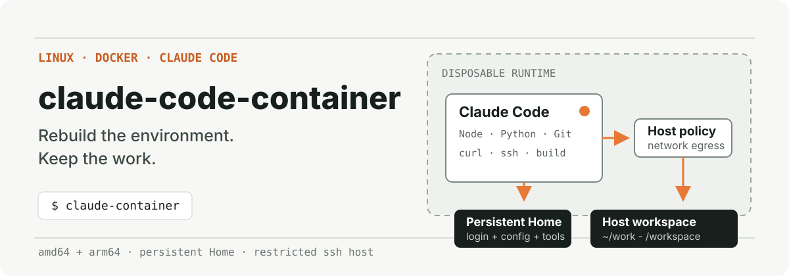
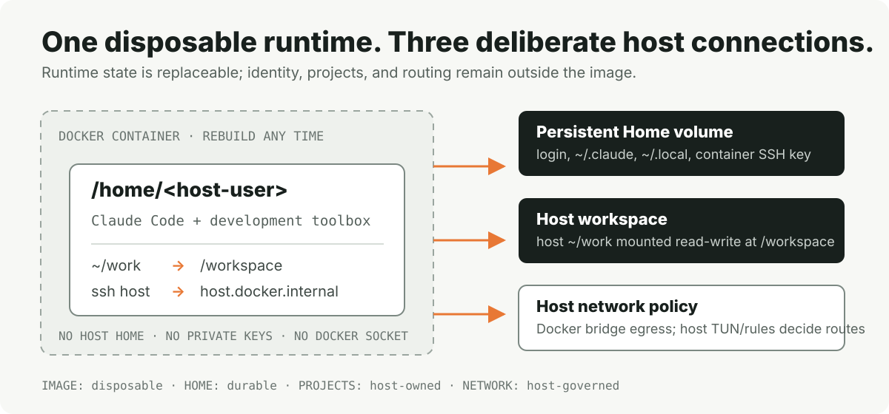

<p align="center">
  
</p>

<p align="center">
  <strong>A portable Linux development container for Claude Code with a persistent identity and a disposable runtime.</strong>
</p>

<p align="center">
  <a href="./LICENSE"></a>
  
  
</p>

`claude-code-container` gives Claude Code a consistent Linux toolbox without turning
the container into the owner of your work. Rebuild the image when the toolchain
changes; keep login state and user-installed tools in a named volume; keep
projects on the host; let the host decide how network traffic is routed.

## Start here

### Requirements

- Linux on `amd64` or `arm64`, or Apple Silicon macOS with OrbStack
- Docker Engine available to the current user without `sudo`; on macOS it is provided by OrbStack
- Bash, Python 3, and a running host OpenSSH server; on macOS, enable Remote Login
- A writable `~/.ssh/authorized_keys`
- Existing directories for all configured mounts; the default preparation is shown below

### Choose the entry point

| Where | Entry | Purpose |
| --- | --- | --- |
| Host | `claude-container [N]` | Enter instance `N`'s shell at its Home; default `1` |
| Host | `claude-herdr [N] [CLAUDE_ARGS...]` | Start Claude directly in the current mounted project; optional wrapper |
| Host | `"$HOME/.local/share/claude-code-container/claude-code-container" [--instance N] <command>` | Install, rebuild, inspect, uninstall, clear, or show help |
| Container | `claude` or `claude update` | Run/sign in to Claude, or update this instance's installation |

The project does not add its internal launcher to `PATH`. `claude-container`
is a shell shortcut implemented as a function, not a second lifecycle CLI:
use the full launcher path for `help`, `doctor`, `reinstall`, `uninstall`, and
`clear`. Examples use the default data directory; if `XDG_DATA_HOME` is set,
replace `$HOME/.local/share` with that directory.

### Install on the host

On Linux with Zsh, export `CLAUDE_CODE_CONTAINER_SHELL_RC="$HOME/.zshrc"`
before running the installation commands. Linux otherwise defaults to `.bashrc`;
macOS defaults to `.zshrc`.

```bash
git clone https://github.com/ada20204/claude-code-container.git
cd claude-code-container
mkdir -p "$HOME/work" "$HOME/Downloads" "$HOME/Documents" "$HOME/Desktop" \
  "$HOME/.claude/projects" "$HOME/.agents"
./install.sh
"$HOME/.local/share/claude-code-container/claude-code-container" --instance 1 install
```

If using custom mount sources, create those directories instead and set their
configuration variables before installation. `.agents` is created automatically
when missing; other required directories are not. The default time zone is
`UTC`; set `CLAUDE_CODE_CONTAINER_TIMEZONE=America/Chicago` before `install` to
build for Chicago.

Reload the host shell configuration for your platform. On macOS with Zsh
(or Linux with the Zsh override above):

```bash
source ~/.zshrc
```

On Linux with Bash:

```bash
source ~/.bashrc
```

Installation reports success only after an actual non-interactive SSH
connection back to the host succeeds.
Conflicting user-defined shell entries, `Host host` entries, or `~/work` paths
are reported instead of overwritten.

### Enter and sign in

On the host:

```bash
claude-container 1
```

Inside the container, start Claude and complete its sign-in prompts:

```bash
cd ~/work
claude
```

The shell starts in Home, not in the host's current project. Home matches the
host user's path: `/home/<user>` on Linux and `/Users/<user>` on macOS.
`~/work` links to `/workspace`. Exit Claude, then exit the container shell to
return to the host; the disposable runtime is removed, but Home data persists.
Inside the container, `ssh host` opens a separate host SSH session with the
generated key. Exit that SSH session to return to the container.

### Use another instance

On the host, prepare and enter instance 2:

```bash
"$HOME/.local/share/claude-code-container/claude-code-container" --instance 2 install
claude-container 2
```

An instance number identifies its persistent Home, not a permanent Docker
container. Reusing the number reuses its login and tools; another number gets
a separate Home by default. Complete sign-in separately in each new instance.
All instances share the image and the configured host-mounted directories.
Do not reuse `CLAUDE_CODE_CONTAINER_HOME_VOLUME` across instances or mount the
full host `~/.claude` if login isolation is required.

To start Claude directly from a host project, install the optional wrapper
using the [Herdr guide](./docs/herdr.md#install-the-host-wrapper), then run on
the host:

```bash
cd ~/work/example  # An existing project covered by a mount
claude-herdr 2 --resume
```

Omit `--resume` for a new conversation. The wrapper preserves the mapped
project directory; unlike `claude-container`, it does not start a Home shell.

## Guides

- [Run containerized Claude Code with Herdr](./docs/herdr.md): keep Herdr and
  SSH on the host while Claude Code runs in the container with the correct
  project working directory.

## What stays when the container goes away

<p align="center">
  
</p>

The image contains Claude Code and the development toolbox. The running
container is disposable. State is divided deliberately:

- **Persistent Home** stores Claude login state, `~/.claude/CLAUDE.md`, the
  container-to-host SSH key, and user-level tools under `~/.local`. Each
  numeric instance has a separate Home volume.
- **Host workspace** keeps projects under the host's `~/work` and mounts them
  read-write at `/workspace`; `~/work` inside the container is a symlink to it.
- **Standard host directories** mount `~/Downloads`, `~/Documents`, `~/Desktop`,
  `~/.claude/projects`, and `~/.agents` read-write at the same paths inside the
  container. Only `~/.claude/projects` is shared from Claude's state directory;
  the rest of `~/.claude` stays inside the instance Home volume.
- **Host network policy** receives normal Docker bridge egress. No proxy URL,
  node, account, or Mihomo configuration is baked into the image.
- **Disposable runtime** can be removed or rebuilt without moving project data
  into a Docker volume.

## Network model

Runtime traffic follows this path:

```text
Claude Code container
  -> Docker bridge
  -> host network stack / NAT
  -> host routing, TUN, firewall, or proxy policy
  -> selected destination
```

This keeps the image portable: a host with Mihomo TUN can route Claude,
GitHub, npm, and direct traffic with its own rules; a host without Mihomo uses
its normal network path. The project does not promise that every host can reach
Claude services. It preserves the host's policy boundary instead of embedding
one machine's proxy configuration.

`CLAUDE_CODE_CONTAINER_BUILD_NETWORK=host` applies only to `docker build`. It is
useful when package downloads must use the host network directly. Runtime
containers still use the Docker bridge.

## Daily workflow

On the host, inspect an instance or enter its shell:

```bash
"$HOME/.local/share/claude-code-container/claude-code-container" --instance 1 doctor
claude-container 1
```

Inside the container, update the persisted Claude installation:

```bash
claude update
```

`doctor` also starts disposable bridge containers to inspect the runtime DNS
resolver and proxy-variable names, then probes the Anthropic API, GitHub, and
the npm registry. It retries each endpoint up to three times. No credentials,
Claude requests, persistent volumes, or proxy settings are used or changed.

When proxy variables are absent, successful probes confirm that the container
can use the host routing boundary directly, including a host-managed TUN. A
failure with a `198.18.x.x` DNS answer points first to the Fake-IP/TUN mapping;
a failure with a normal address points first to the selected host routing or
proxy-policy group. This distinction avoids adding a permanent container proxy
to work around a transient host-policy problem.

The build requests the latest Claude Code release by default. Docker may reuse
the cached Claude installation layer during a rebuild, so `claude update`
inside the persistent environment is the direct way to refresh an existing
installation. Set `CLAUDE_CODE_CONTAINER_CLAUDE_VERSION` to an exact version when
reproducible builds matter more than receiving the latest release.

## Lifecycle

Run lifecycle commands on the host, not inside the container. For example:

```bash
launcher="$HOME/.local/share/claude-code-container/claude-code-container"
"$launcher" help
"$launcher" --instance 2 reinstall
```

| Command | Instance runtime | Persistent Home |
| --- | --- | --- |
| `~/.local/share/claude-code-container/claude-code-container install` | Build and initialize | Create or reuse |
| `~/.local/share/claude-code-container/claude-code-container reinstall` | Rebuild and repair | Preserve |
| `~/.local/share/claude-code-container/claude-code-container uninstall` | Remove containers and host SSH access | Preserve |
| `~/.local/share/claude-code-container/claude-code-container clear` | Remove containers and host SSH access | Delete after confirmation |
| `~/.local/share/claude-code-container/claude-code-container clear --yes` | Remove containers and host SSH access | Delete without prompting |

`reinstall` builds a replacement image before stopping the selected instance's
containers and repairing its integration. `clear` is destructive: it removes
Claude login state, user-installed tools, container SSH material, and every
other file in the named Home volume.
Add `--instance N` before the command to select an instance. The shared image
and `claude-container` shell entry point survive `uninstall` and `clear`, so
other instances remain usable. Rebuilding replaces the shared image for future
starts; existing containers of other instances are not stopped.
Host-mounted projects, histories and skills are never deleted by these commands.
To delete just instance 2's Home, run on the host:

```bash
"$HOME/.local/share/claude-code-container/claude-code-container" --instance 2 clear
```

This prompts before deletion. Add `--yes` only when intentionally automating
permanent deletion. Entering the same number again recreates a fresh Home after
`clear`, or reuses its retained Home after `uninstall`, and restores SSH access.

An older explicit `.agents` mount is accepted when its source matches the
standard mount and it is read-write. Conflicting sources or read-only overrides
still fail instead of silently changing access permissions.

## Included toolbox

- Node.js, npm, Corepack, and pnpm
- Python, pip, and `venv`
- Git, curl, OpenSSH client, rsync, jq, ripgrep, and fd
- Zsh with a pinned Oh My Zsh installation and a non-destructive default `.zshrc`
- tmux for persistent terminal sessions
- GCC, G++, make, pkg-config, and OpenSSL headers
- `ip`, `ifconfig`, `ping`, `dig`, `nc`, `lsof`, `ps`, and `pkill`
- Archive and file inspection utilities

On Linux, the container UID and GID are derived from the installing host user so
files created in `/workspace` retain the expected ownership. On macOS, the
container uses UID/GID 1000 because OrbStack virtualizes bind-mount ownership;
this also avoids collisions with macOS system group IDs. Matching the host Home
path keeps absolute paths in shared Claude project records consistent.

## Configuration

The defaults are useful on a conventional Linux workstation. Override only the
parts owned by the local host:

| Variable | Default | Purpose |
| --- | --- | --- |
| `CLAUDE_CODE_CONTAINER_IMAGE` | `claude-code-container:latest` | Managed Docker image |
| `CLAUDE_CODE_CONTAINER_INSTANCE` | `1` | Default instance for the lifecycle launcher; shortcuts use their numeric argument or `1` |
| `CLAUDE_CODE_CONTAINER_HOME_VOLUME` | `claude-code-container-home` for instance 1, `claude-code-container-home-N` otherwise | Persistent Home volume for instance `N` |
| `CLAUDE_CODE_CONTAINER_WORKSPACE` | `~/work` | Host project directory |
| `CLAUDE_CODE_CONTAINER_DOWNLOADS` | `~/Downloads` | Host Downloads directory |
| `CLAUDE_CODE_CONTAINER_DOCUMENTS` | `~/Documents` | Host Documents directory |
| `CLAUDE_CODE_CONTAINER_DESKTOP` | `~/Desktop` | Host Desktop directory |
| `CLAUDE_CODE_CONTAINER_CLAUDE_PROJECTS` | `~/.claude/projects` | Host Claude project history |
| `CLAUDE_CODE_CONTAINER_AGENTS` | `~/.agents` | Host-managed shared agent configuration and skills |
| `CLAUDE_CODE_CONTAINER_EXTRA_HOME_DIRS` | unset | Comma-separated extra Home directory names to mount at matching paths |
| `CLAUDE_CODE_CONTAINER_MOUNTS` | unset | Semicolon-separated `HOST_PATH:CONTAINER_PATH[:ro]` custom mounts |
| `CLAUDE_CODE_CONTAINER_DOCKERFILE` | `~/.local/share/claude-code-container/Dockerfile` | Build input |
| `CLAUDE_CODE_CONTAINER_TIMEZONE` | `UTC` | Container time zone |
| `CLAUDE_CODE_CONTAINER_CLAUDE_VERSION` | `latest` | Claude Code release or exact version |
| `CLAUDE_CODE_CONTAINER_CLAUDE_BINARY` | unset | Trusted absolute path to a local Claude Code binary used only at build time |
| `CLAUDE_CODE_CONTAINER_BUILD_NETWORK` | unset | Optional Docker build network |
| `CLAUDE_CODE_CONTAINER_BASE_IMAGE` | pinned official Node image | Registry mirror with the same digest |
| `CLAUDE_CODE_CONTAINER_DEBIAN_MIRROR` | Debian official | Package mirror |
| `CLAUDE_CODE_CONTAINER_DEBIAN_SECURITY_MIRROR` | Debian official | Security package mirror |
| `CLAUDE_CODE_CONTAINER_NODE_DIST_BASE_URL` | `https://nodejs.org/dist` | Node.js distribution mirror |
| `CLAUDE_CODE_CONTAINER_SHELL_RC` | `~/.bashrc` on Linux, `~/.zshrc` on macOS | File receiving the managed shell shortcut |

`run` can preserve a host working directory when that directory is covered by
one of the standard, extra, or custom mounts:

```bash
"$HOME/.local/share/claude-code-container/claude-code-container" \
  run --cwd "$PWD" -- claude --resume
```

The launcher translates the host path to its container mount target and fails
when the directory is not mounted. It never silently falls back to the
container Home directory.

Example for a Linux host that needs local mirrors and host networking during build:

```bash
export CLAUDE_CODE_CONTAINER_TIMEZONE=America/Chicago
export CLAUDE_CODE_CONTAINER_BUILD_NETWORK=host
node_digest='sha256:f32b81066cde10a75dbac96646099533316d94bac4150c55da1636e1f0ffdc46'
export CLAUDE_CODE_CONTAINER_BASE_IMAGE="mirror.example/library/node@$node_digest"
export CLAUDE_CODE_CONTAINER_DEBIAN_MIRROR='https://mirror.example/debian'
export CLAUDE_CODE_CONTAINER_DEBIAN_SECURITY_MIRROR='https://mirror.example/debian-security'
export CLAUDE_CODE_CONTAINER_NODE_DIST_BASE_URL='https://mirror.example/node'

"$HOME/.local/share/claude-code-container/claude-code-container" install
```

When a host requires a proxy only while building, pass standard proxy variables
for that invocation. They become Docker build arguments, not persistent image
settings. For macOS with OrbStack, use its container-reachable host name and
replace the example port with the actual proxy port:

```bash
HTTP_PROXY='http://host.docker.internal:7890' \
HTTPS_PROXY='http://host.docker.internal:7890' \
  "$HOME/.local/share/claude-code-container/claude-code-container" install
```

In a default bridge build, `127.0.0.1` means the build container itself, not
the Mac. On Linux, a loopback-only host proxy requires
`CLAUDE_CODE_CONTAINER_BUILD_NETWORK=host`; otherwise use a proxy address
reachable from the build network. On macOS, host networking refers to the
Docker VM, so it is not a substitute for reaching the Mac through OrbStack.
These build settings do not configure runtime proxy variables or change TUN.

When the official release host is unavailable or rate-limited, an existing
trusted Linux Claude Code binary for the target CPU architecture can seed the
image without being mounted at runtime:

```bash
export CLAUDE_CODE_CONTAINER_CLAUDE_BINARY='/absolute/path/to/linux-arm64/claude'
"$HOME/.local/share/claude-code-container/claude-code-container" install
```

The seed is copied into a temporary build context, checked by running
`--version`, and then stored inside the image. It bypasses the official
download and its checksum manifest, so only use a locally trusted executable.
Run `claude update` inside the container later to move to a newer release.
A native macOS executable cannot be used as the Linux binary seed.

Host-specific directories stay outside the public defaults. For example:

```bash
export CLAUDE_CODE_CONTAINER_EXTRA_HOME_DIRS='private-projects,company-code'
claude-container
```

For paths that do not belong at matching Home locations, pass one or more
custom mounts for a single invocation:

```bash
claude-container 1 \
  --mount "$HOME/data:/data:ro" \
  --mount "$HOME/client-project:/projects/client"
```

Use `CLAUDE_CODE_CONTAINER_MOUNTS` for persistent defaults. Separate entries
with semicolons; each entry is read-write unless it ends in `:ro`:

```bash
export CLAUDE_CODE_CONTAINER_MOUNTS="$HOME/data:/data:ro;$HOME/client-project:/projects/client"
"$HOME/.local/share/claude-code-container/claude-code-container" install
```

`install` records the configured value in the managed shell block, so the
`claude-container` shell shortcut reuses it. Source paths must exist, targets must be
absolute, and custom mounts cannot replace the managed Home, workspace, or
standard directory targets. A read-write mount exposes those host files to
commands running in the container; prefer `:ro` when writes are unnecessary.

## Security boundary

- No Docker socket, host private key, host Home, GPU, or privileged mode is
  mounted.
- No ports are published and no credentials or proxy configuration are baked
  into the image. Build-time standard proxy variables are passed as transient
  Docker build arguments only.
- The container generates its own Ed25519 key inside the persistent Home
  volume. On Linux, host authorization is limited to the Docker bridge subnet.
  On macOS, OrbStack forwards host access from loopback, so authorization is
  limited to `127.0.0.1/32`. Both disable agent, port, X11, and user-rc forwarding.
- Managed containers carry a volume-specific label so lifecycle cleanup does
  not select unrelated containers.
- `ssh host` grants the same shell privileges as the installing host user. The
  source and forwarding restrictions do **not** make that access read-only.

Read [SECURITY.md](./SECURITY.md) before exposing the environment to untrusted
code.

## Development

```bash
shellcheck bin/claude-code-container bin/claude-herdr install.sh tests/*.sh
./tests/test.sh
```

CI runs the same ShellCheck and installer tests on every push and pull request.
For a real Docker test on a configured Linux host or macOS with OrbStack, run
`bash tests/docker-smoke.sh`. It builds a separate test image, creates two
temporary instances and temporary shared directories, and tests SSH access to
the host. It adds and removes only its own host public keys and cleans up the
test image and volumes; existing login state and project directories are not
mounted. The host SSH server must already be available.

## License

[MIT](./LICENSE)
